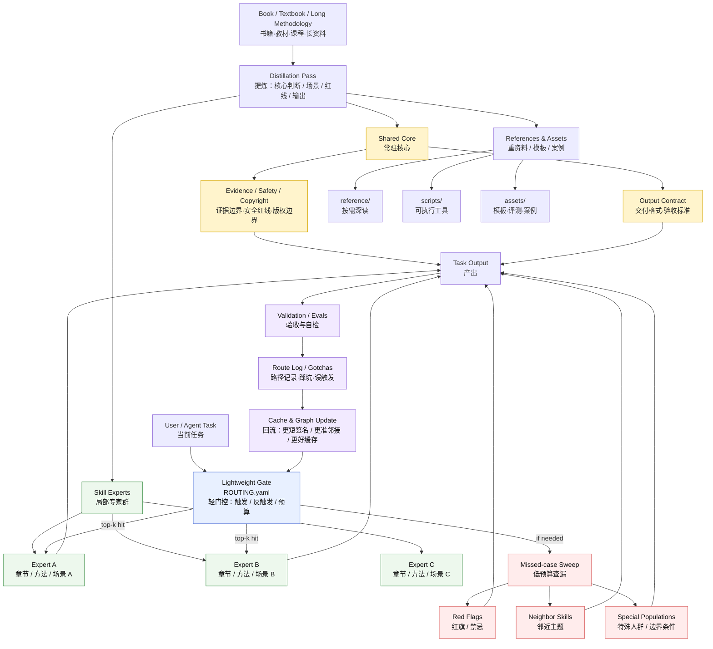

# book-to-skill-distillation sparse overlay — Structure Diagram

This diagram shows how a long source such as a book, textbook, course, or project methodology is distilled into a sparse, callable Skill system.



## One-line model

```text
Book
  -> shared core + routed experts + heavy references
  -> lightweight gate
  -> top-k activation + missed-case sweep
  -> output + validation
  -> route log / gotcha / eval feedback
  -> better cache hit next time
```

## Chinese shorthand

> 先炼核心，再分专家；先中主脉，再扫旁枝；预算分层，重料后置；路由留痕，越用越准。

> 网给 Skill 以通达，环给 Skill 以低功耗；分支出去，回流成丹。


## Proposal-based self-evolution

The feedback loop is intentionally not a hidden auto-mutation loop. Route logs, gotchas, and missed cases should become **reviewable patches** to `ROUTING.yaml`, `GRAPH.md`, `CACHE.md`, and eval cases. See [`self-evolution-loop.md`](self-evolution-loop.md).
